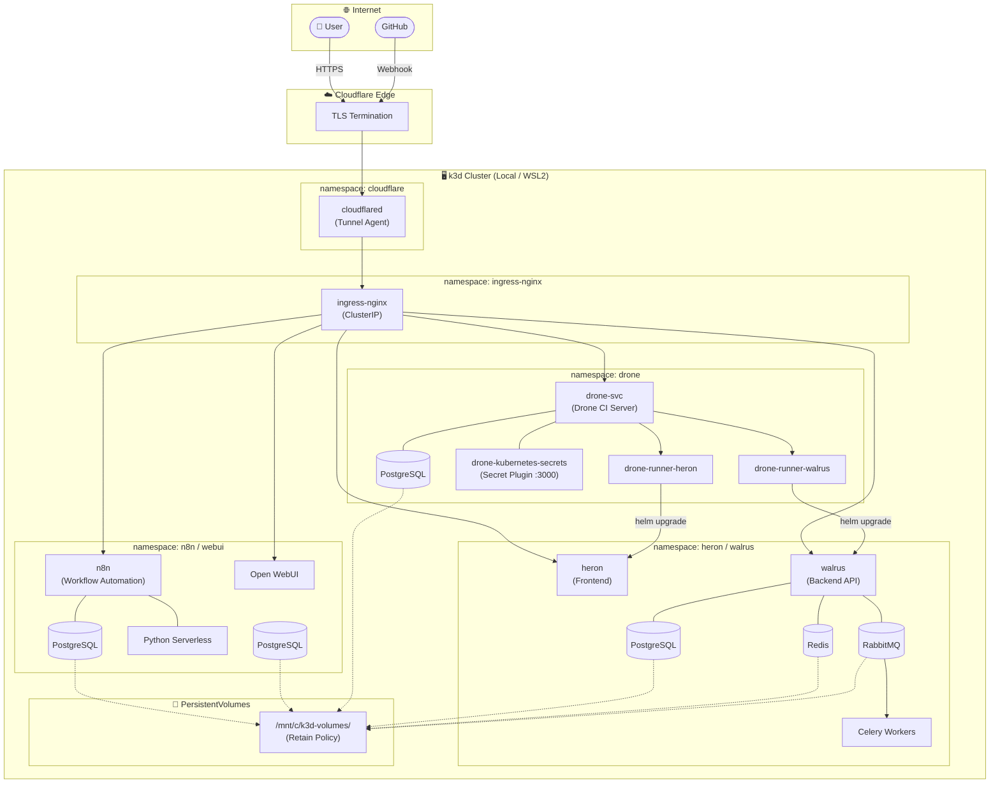
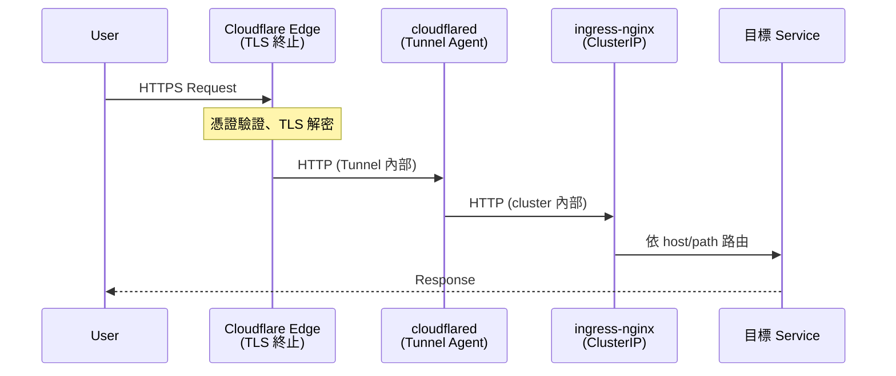
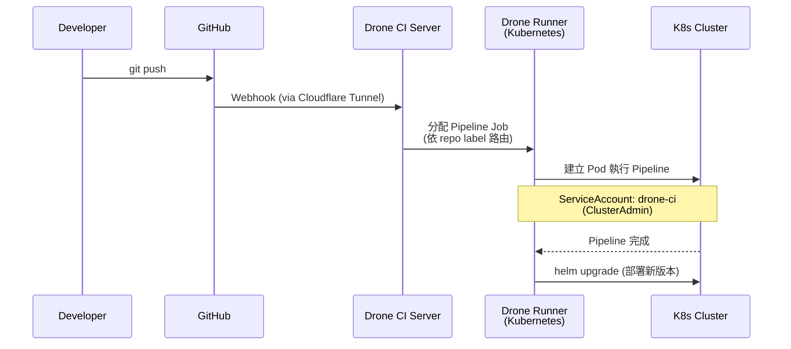
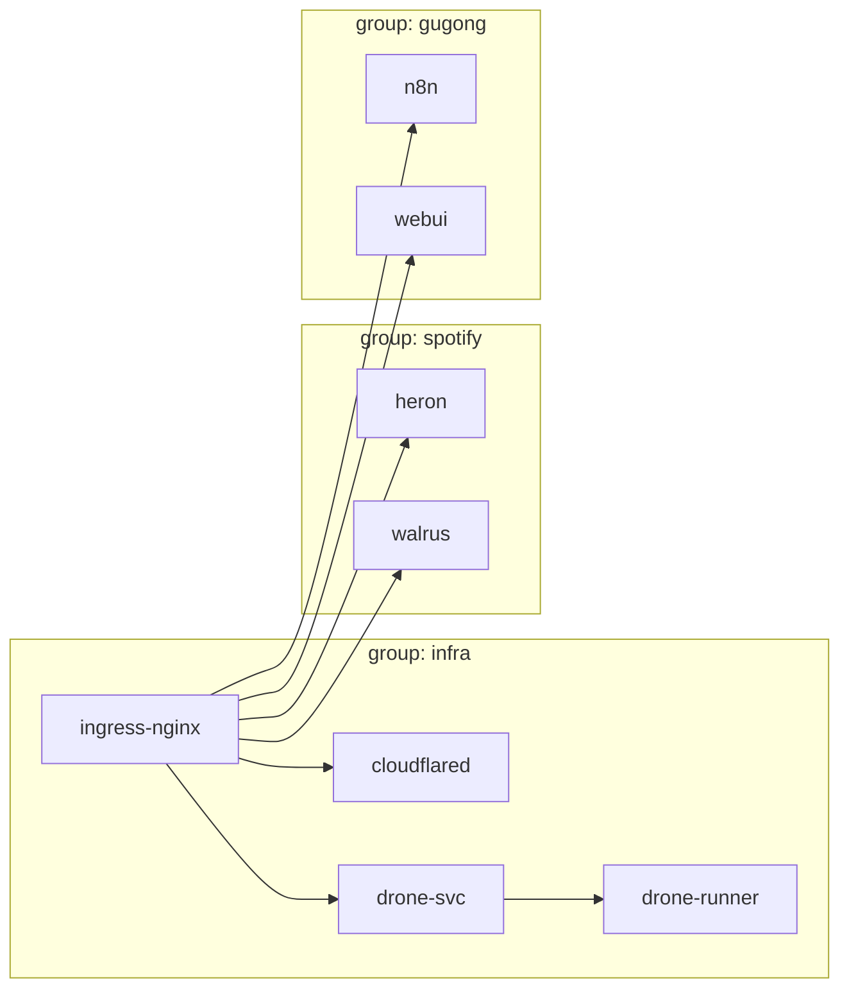

# 🕊️ Dove — Kubernetes Infrastructure Config

> **Dove** 是 Lab3-Spotify 的 Kubernetes 基礎設施配置倉庫，  
> 以 **Helmfile** 統一管理所有服務的部署生命週期。

---

## 架構總覽



---

## 網路流向



> **TLS 由 Cloudflare 在邊緣終止**，cluster 內部全程走 HTTP，  
> 不需要 cert-manager 或 Let's Encrypt。

---

## CI/CD 流程



### Runner 路由機制

每個 Repo 有**專屬的 Runner Deployment**，透過 label 篩選對應的 pipeline：

| Runner | Label | 負責 Repo |
|--------|-------|-----------|
| `drone-runner-walrus` | `repo:Lab3-Spotify-walrus` | walrus |
| `drone-runner-heron` | `repo:Lab3-Spotify-heron` | heron |

---

## Helmfile 部署群組



所有服務都依賴 `ingress-nginx` 作為入口點，`drone-runner` 額外依賴 `drone-svc` 啟動完畢。

---

## 目錄結構

```
dove/
├── helmfile.yaml              # 統一部署入口
├── Makefile                   # Helm repo 管理
│
├── ingress-controller/        # ingress-nginx 設定
│   └── ingress-nginx-controller.yaml
│
├── cloudflare/                # Cloudflare Tunnel (namespace: cloudflare)
│   ├── values/staging.yaml
│   └── secrets/               # git-secret 加密
│
├── drone-svc/                 # Drone CI Server + PostgreSQL
│   ├── templates/
│   │   ├── statefulset.yaml   # Drone Server
│   │   ├── pipeline-secrets.yaml
│   │   └── secrets-extension.yaml  # Kubernetes Secret Plugin
│   └── authorize-drone-ci.yaml    # SA 永久 Token
│
├── drone-runner/              # Drone Kubernetes Runner
│   └── templates/
│       └── deployment.yaml    # 每個 repo 一個 Deployment
│
├── heron/                     # Frontend (heron.lab3.website)
├── walrus/                    # Backend API (walrus.lab3.website)
│                              # └── PostgreSQL + Redis + RabbitMQ + Celery
│
├── n8n/                       # Workflow Automation (lab3-n8n.ddns.net)
│   └── templates/             # └── PostgreSQL + Python Serverless
│
├── webui/                     # Open WebUI (lab3-gugong.ddns.net)
│   └── functions/             # └── PostgreSQL
│
└── cmd-template/              # 常用指令速查
    ├── staging.bash
    └── gugong.bash
```

---

## 儲存架構

所有 Stateful 服務使用 **k3d HostPath** 掛載，設定 `Retain` policy 避免 PVC 刪除時資料遺失：

```
/mnt/c/k3d-volumes/
├── walrus/
│   ├── walrus-db/        (PostgreSQL)
│   ├── walrus-redis/     (Redis)
│   └── walrus-rabbitmq/  (RabbitMQ)
├── n8n/
│   ├── n8n-data/         (n8n 工作流資料)
│   └── n8n-db/           (PostgreSQL)
└── webui/
    └── webui-db/         (PostgreSQL)
```

---

## Secret 管理

使用 **[git-secret](https://git-secret.io/)** 加密敏感設定，加密檔案以 `.secret` 副檔名存放於 repo 中：

```bash
# 解密 (需持有 GPG private key)
git secret reveal

# 加密後提交
git secret hide
git add . && git commit
```

| 加密檔案 | 對應明文 |
|----------|----------|
| `*/secrets/staging.yaml.secret` | `*/secrets/staging.yaml` |

---

## 快速開始

### 1. 初始化 Helm Repos

```bash
make repos
```

### 2. 解密 Secrets

```bash
git secret reveal
```

### 3. 部署所有服務

```bash
# 全部部署
helmfile apply

# 只部署 infra 群組
helmfile apply -l group=infra

# 只部署 spotify 應用
helmfile apply -l group=spotify
```

### 4. 更新單一服務

```bash
helmfile apply -l name=drone-runner
```

---

## 服務一覽

| 服務 | 群組 | Domain | 說明 |
|------|------|--------|------|
| ingress-nginx | infra | — | Cluster 入口路由 |
| cloudflared | infra | — | Cloudflare Tunnel Agent |
| drone-svc | infra | `drone.lab3.website` | CI Server + 秘密管理 |
| drone-runner | infra | — | Kubernetes Pipeline Runner |
| heron | spotify | `heron.lab3.website` | Frontend |
| walrus | spotify | `walrus.lab3.website` | Backend API |
| n8n | gugong | `lab3-n8n.ddns.net` | 自動化工作流 |
| webui | gugong | `lab3-gugong.ddns.net` | Open WebUI (AI 介面) |
